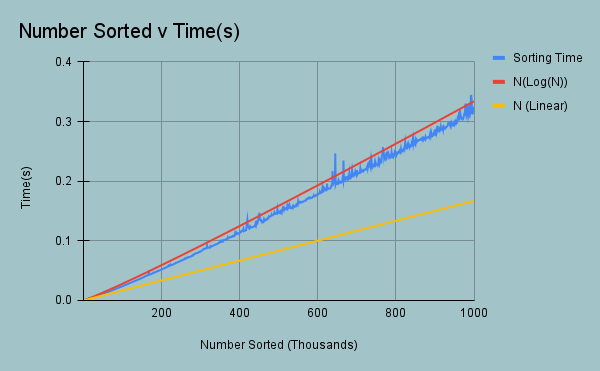

# Heap
Made a heap (alongside a heapsort) for a class, and decided that I was proud enough of the implementation that I wanted to move it to my own repository (yes libraries everywhere have this I just had a lot of fun with the assignment)

I also added some examples of the speed of my implementation of heap sort (ran using no optimization flags on the g++ compiler)

